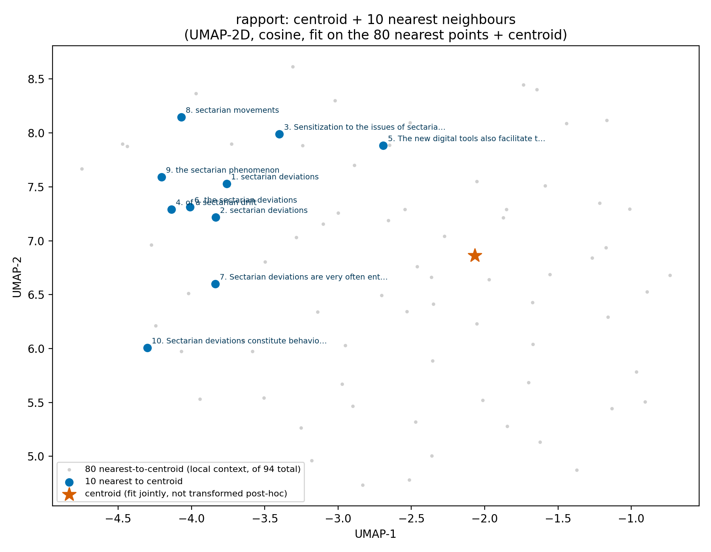
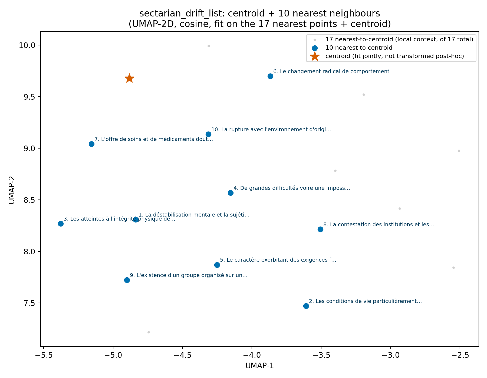
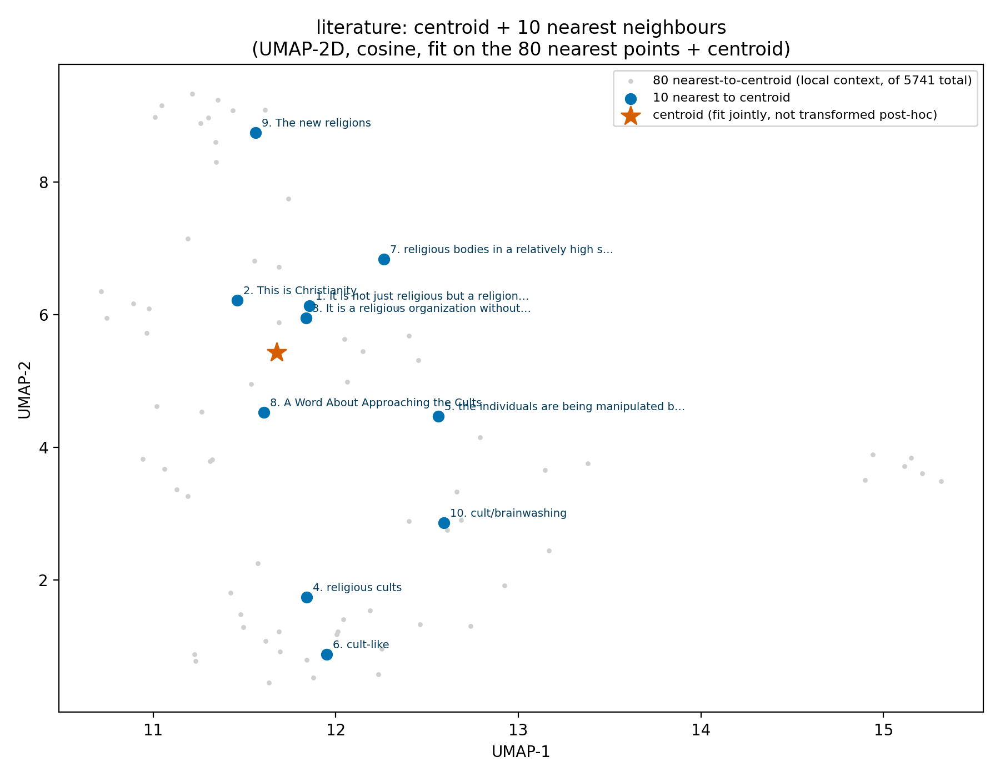
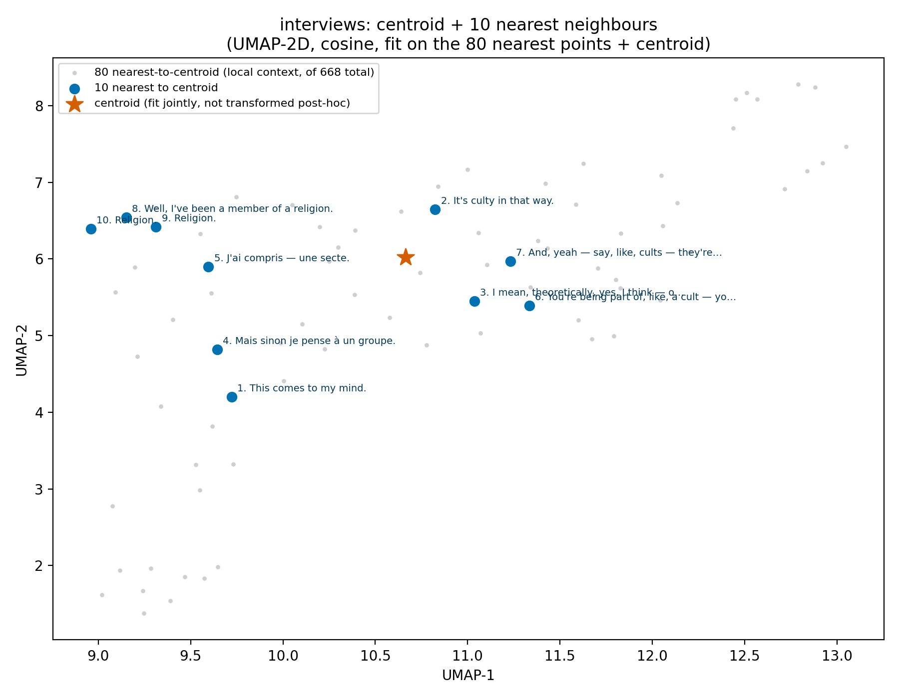
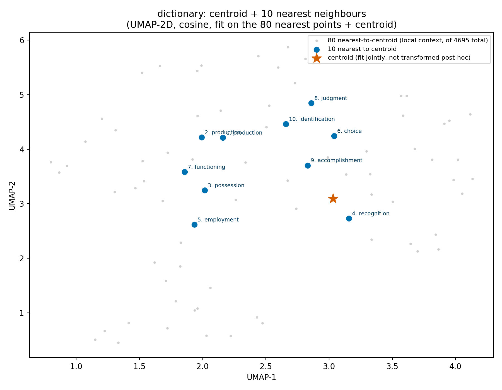
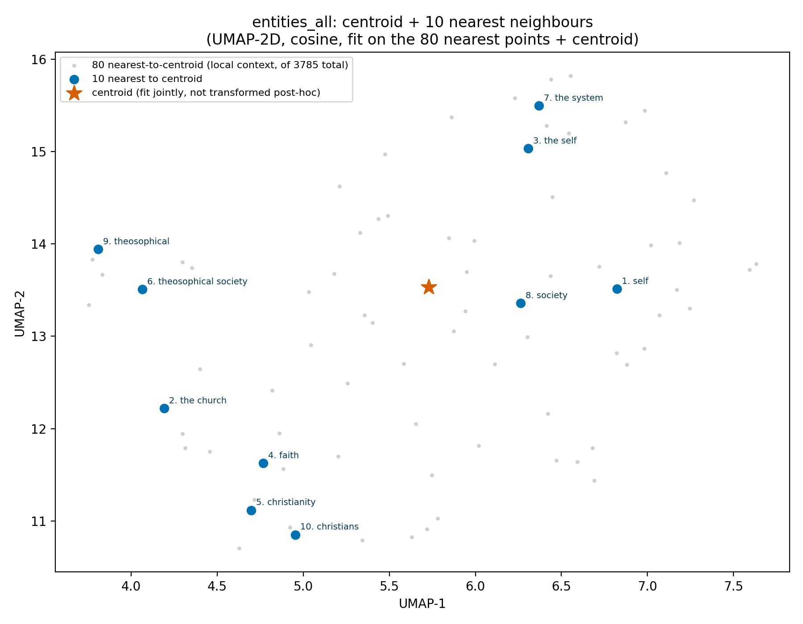
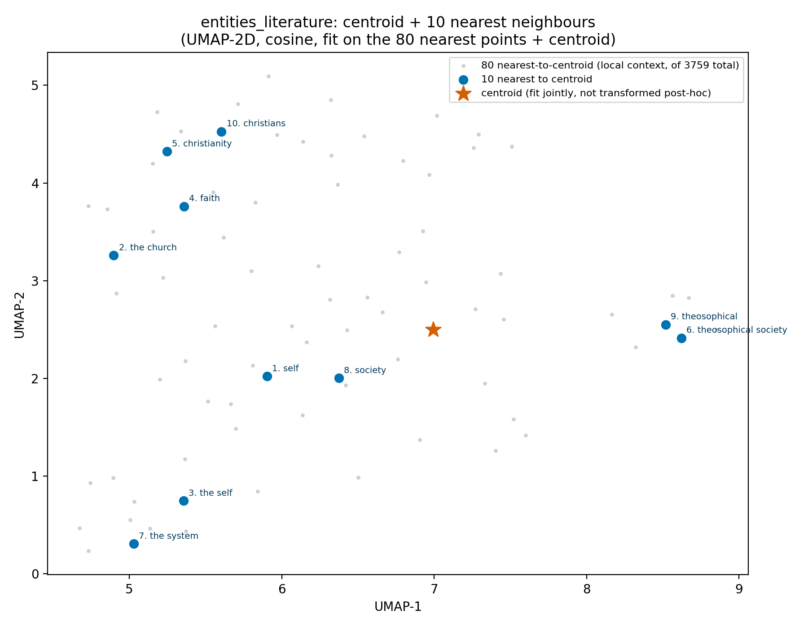
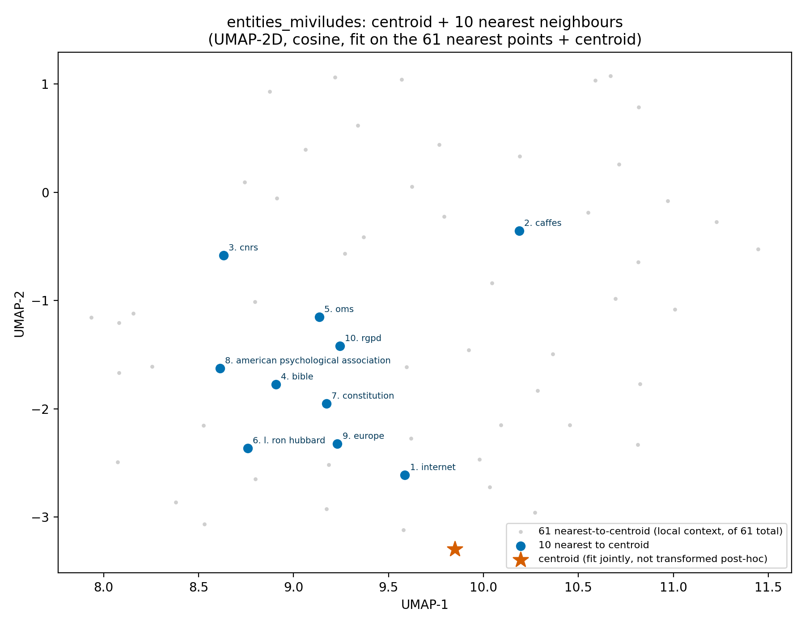
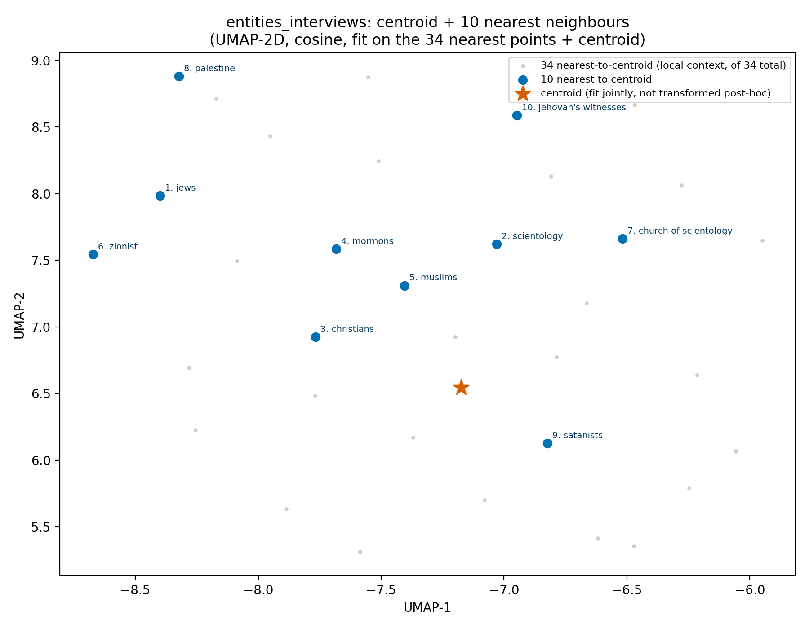

# Per-corpus centroids + nearest neighbours (raw bge-m3, no PCA)

Data inventory: [`00_Available_Data.md`](00_Available_Data.md). Index: [`Results_Draft.md`](Results_Draft.md).

**Revised from an earlier pass that used `shared_space_v3`'s standardized+PCA'd coordinates**
(see [`01_Shared_Space_v3.md`](01_Shared_Space_v3.md)). Checked empirically: standardizing
alone (no PCA at all) already produces about as much nearest-neighbour ranking jitter as the
full standardize+PCA-truncate pipeline (Spearman ρ≈0.996 vs. raw, on a 94-point test group;
PCA's own rotation step is exactly distance-preserving, verified to 1e-14 — the distortion is
from standardization, not rotation/truncation). And the reason shared_space_v3 exists at all —
comparability across *independently-fit* per-corpus spaces — doesn't apply to raw vectors:
every corpus is embedded by the same fixed bge-m3 model with no per-corpus fitting, so raw
vectors are already directly cosine-comparable with zero transformation. bge-m3 is itself
trained with a cosine-similarity objective, so raw-space cosine is the geometry the model was
actually optimized to produce. So: this step now works straight off raw `embedding_vector`
fields, no `StandardScaler`/PCA. (Raw vectors are unit-norm — verified — which makes
Euclidean-distance and cosine-similarity rankings against a fixed query exactly equivalent
here, so no new distance code was needed, just removing the standardize/PCA step.)

For 9 groups: centroid + 10 nearest member points + a **UMAP-2D** scatter (metric="cosine",
fit fresh on each group's own raw vectors) with centroid (★) and neighbours annotated —
switched from a fixed PCA-2D slice, which had put rank-1 neighbours visually far from the
centroid (see "why" below).

**Group definitions** (2 are judgment calls, flagged so they're easy to correct):
`rapport` = MIVILUDES activity-report expressions only (94; excludes the 14 expressions
extracted from the separate "Comment identifier..." raw-transcript document — say if you
wanted those folded in instead/also); `sectarian_drift_list` = the 17 structured MIVILUDES
criteria (read as "the list" the report enumerates); `dictionary` = concept_backbone +
structural_concepts + conceptnet_concepts pooled (4,695 — the 3 files under `dictionaries/`);
`literature`/`interviews` = straight corpus groups. Plus entities, all as subsets of the
single 3,785-point emergent-entity set (one embedding per entity — "entities in corpus X"
= entities with ≥1 mention there, via `mention_distribution`, not a separate embedding).

| Group | n | Nearest-to-centroid (rank 1) |
|---|---|---|
| `rapport` | 94 | "sectarian deviations" |
| `sectarian_drift_list` | 17 | "La déstabilisation mentale et la sujétion psychologique..." |
| `literature` | 5,741 | "It is not just religious but a religion." |
| `interviews` | 668 | "This comes to my mind." |
| `dictionary` | 4,695 | "production" |
| `entities_all` | 3,785 | "self" |
| `entities_literature` | 3,759 | "self" |
| `entities_miviludes` | 61 | "internet" |
| `entities_interviews` | 34 | "jews" |

Nearly identical top-1 results to the PCA version (expected — the two rankings agree closely
except at the margins), which is itself a useful sanity check that the earlier PCA-based
numbers weren't wildly off, just imprecise at the edges.

**Why neighbours still didn't look close after switching to UMAP, and the actual fix**: two
separate problems, not one. (1) A PCA-2D slice's 2 axes explain *global* variance, not local
neighbour structure — that part UMAP already fixes. (2) But the centroid is the *mean* of many
unit vectors, so it's not itself unit-norm and can sit in a genuinely sparse region between
sub-clusters — and the previous version fit UMAP on real points only, then placed the centroid
afterward via `.transform()`, which is an approximate local interpolation for new points, not
a real fit — adding its own placement error on top of (1). Fixed by (a) fitting UMAP on the
centroid *jointly* with real points (it's now one of the fitted points, not projected in
after the fact), and (b) fitting on a zoomed-in **local neighbourhood** — the 80 points
nearest the centroid, not the whole group — since burying the top-10 inside a fit spanning
thousands of points made any local tightness illegible regardless of method. Now the centroid
star sits inside the highlighted cluster in every plot (see `centroid_rapport.png`,
`centroid_literature.png`).

**A second, real bug found while investigating why some plots (e.g. `dictionary`) still didn't
look tight**: the local-context reconstruction matched points back to their rank by `key`
(`document_id:chunk_index`), which is NOT guaranteed unique — MIVILUDES especially pulls
several expressions from one chunk (checked: `rapport`'s 94 expressions span only 70 unique
keys). This silently collapsed/misassigned points whenever a key repeated (94 → 62 points
plotted instead of 80). Fixed by using sort position directly instead of a key lookup — see
`analyze_corpus_centroids.py`'s `plot_group`. All plots above are regenerated post-fix.

**Even after both fixes, some groups (`dictionary`, `entities_all`) still show the centroid
somewhat apart from its top-10.** Investigated with a dedicated multi-technique comparison —
see [`04_Projection_Techniques_Comparison.md`](04_Projection_Techniques_Comparison.md) —
rather than assume the projection is at fault: **5 different 2-D techniques, including
classical MDS (which directly optimizes to preserve real pairwise distances, not just local
topology like UMAP/t-SNE), all show the same separation for the same group.** That rules out
"bad projection" as the explanation — it's a real property of the underlying geometry: a
centroid's "10 nearest" points can be only modestly closer than a typical point (not a tight,
isolated cluster), or can individually sit close to the centroid from many different
directions without being mutually close to each other (a "shell," not a "ball") — either way,
no 2-D picture can make that look like a tight huddle without misrepresenting it. See the
comparison file for the full readout and per-group diagnostics.

### rapport

1. sectarian deviations
2. sectarian deviations
3. Sensitization to the issues of sectarian deviations
4. of a sectarian drift
5. The new digital tools also facilitate the emergence and spread of sectarian deviations.
6. the sectarian deviations
7. Sectarian deviations are very often entangled with other situations of violence and danger in which the minor is the victim.
8. sectarian movements
9. the sectarian phenomenon
10. Sectarian deviations constitute behaviors that, through various means—particularly by relying on beliefs or doctrines—aim to place individuals in a state of submission that results in multiple personal and financial damages.

### sectarian_drift_list

1. La déstabilisation mentale et la sujétion psychologique ou physique conduisant à des actions ou abstentions gravement préjudiciables aux personnes et plus généralement à la perte d'esprit critique et d'autonomie
2. Les conditions de vie particulièrement éprouvantes ou déstabilisantes
3. Les atteintes à l'intégrité physique des personnes en état de faiblesse et d'ignorance, et plus généralement la commission d'actes criminels ou délictueux sur des individus, majeurs ou mineurs
4. De grandes difficultés voire une impossibilité pour un membre de quitter ledit groupe
5. Le caractère exorbitant des exigences financières ; la violation des règlements ou de la loi (travail illégal, formation professionnelle déviante…) et/ou l'opacité de la gestion financière
6. Le changement radical de comportement
7. L'offre de soins et de médicaments douteux et exclusive du recours à des pratiques conventionnelles
8. La contestation des institutions et les troubles à l'ordre public ; la menace d'atteinte à l'ordre public
9. L'existence d'un groupe organisé sur un mode autoritaire, opaque et cloisonné, avec présence d'un dirigeant de type leader charismatique ou praticien référent exclusif
10. La rupture avec l'environnement d'origine (proches, famille)

### literature

1. It is not just religious but a religion.
2. This is Christianity.
3. It is a religious organization without a doubt.
4. religious cults
5. the individuals are being manipulated by a cunning and probably unscrupulous cult leader
6. cult-like
7. religious bodies in a relatively high state of tension with their environments
8. A Word About Approaching the Cults
9. The new religions
10. cult/brainwashing

### interviews

1. This comes to my mind.
2. It's culty in that way.
3. I mean, theoretically, yes, I think — or a sect would be a cult under a religious umbrella, probably.
4. Mais sinon je pense à un groupe.
5. J'ai compris — une secte.
6. You're being part of, like, a cult — you just think you're part of a community, or something like that.
7. And, yeah — say, like, cults — they're just like a really, really niche, small group that's against a topic.
8. Well, I've been a member of a religion.
9. Religion.
10. Religion.

### dictionary

1. production
2. production
3. possession
4. recognition
5. employment
6. choice
7. functioning
8. judgment
9. accomplishment
10. identification

### entities_all

1. self
2. the church
3. the self
4. faith
5. christianity
6. theosophical society
7. the system
8. society
9. theosophical
10. christians

### entities_literature

1. self
2. the church
3. the self
4. faith
5. christianity
6. theosophical society
7. the system
8. society
9. theosophical
10. christians

### entities_miviludes

1. internet
2. caffes
3. cnrs
4. bible
5. oms
6. l. ron hubbard
7. constitution
8. american psychological association
9. europe
10. rgpd

### entities_interviews

1. jews
2. scientology
3. christians
4. mormons
5. muslims
6. zionist
7. church of scientology
8. palestine
9. satanists
10. jehovah's witnesses

## Centroids by epistemic status

Same method, split one level further by `epistemic_status` (asserted/contested/speculative/
negated) within each expression corpus — moved to its own file since it produced a substantial
confirmed finding (does a contested term like "brainwashing" actually live in the corpus's
*contested* subgroup?). See **[`05_Epistemic_Status_Centroids.md`](05_Epistemic_Status_Centroids.md)**
for the full writeup, all 8 subgroup listings, and figures.

Full data (all groups, this file and 05): [`data/centroid_neighbors.csv`](data/centroid_neighbors.csv).

## Per-criterion neighbours (not group centroids — each of the 17 criteria as its own query)

For each of the 17 sectarian-drift criteria individually: its nearest entities, literature
expressions, AND interview segments (3 pools, each pool's own points only). Top 3 of each
shown below; **full 5+10+10 listing per criterion (all 17) in
[`03_Per_Criterion_Neighbors.md`](03_Per_Criterion_Neighbors.md)**; machine-readable version in
[`data/criterion_nearest_neighbors.csv`](data/criterion_nearest_neighbors.csv) (425 rows).

| Criterion | Top entities | Top literature | Top interviews |
|---|---|---|---|
| Mental destabilization | thought reform and the psychology of totalism · dianetics (the modern science of mental health) · DSM | "Groups aiming through maneuvers of psychological..." | "So, I'd picture something American, okay — brainwashing..." |
| Rupture with origin environment | radical departures · self transformation · falling from the faith | "religious bodies in a relatively high state of tension..." | "attempting to deviate from academic norms through 'breaking boundaries'..." |
| Radical behavior change | self transformation · human individual metamorphosis · self-transformation | "sudden personality change" | "I think it changes depending on what I've been doing in the last days." |
| Rejection of outside world | alienation and charisma · submissiveness · silence | "world rejecting" | "I would say, okay, they also practice the ideology so strictly..." |
| Harsh living conditions | intensified conflict · life · coercive persuasion | "religious bodies in a relatively high state of tension..." | "something nasty, something really nasty." |
| Deceptive recruitment | coercive persuasion · brainwashing-claims critique · training of the cadre | "'If recruitment techniques are so sinister,' asks..." | "It's really easy to get kind of convinced to join a cult..." |
| Indoctrination of children | children in new religions · "let our children go!" · training of the cadre | "The children are our future." | "En les attirant vers quelque chose." |
| Authoritarian/opaque group | charismatic authority · charismatic leadership · evolving perspectives on charismatic leadership | "Charismatic authority: Leadership was secretive..." | "Because they have a singular leader, it's not easy to get into the group..." |
| Difficulty leaving the group | radical departures · satanic groups · concerned relatives | "it is almost impossible for the person to leave..." | "And the members have to live by the rules of the group — very strict rules." |
| Physical-integrity harm | submissiveness · crimes of obedience · conscientious objection | "It is a deviation from freedom of thought, opinion..." | "Something suspicious, something dangerous, something not normal." |
| Contesting public order | religion and the social order · conscientious objection · constitution of society | "It is a deviation from freedom of thought, opinion..." | "Something suspicious, something dangerous, something not normal." |
| Legal disputes | thelema · dramatic denouements · dramatic denouement | "it is necessary to prove that there exists a spec..." | "That's interesting." |
| Financial demands/opacity | conformity · regulating religion · coercive persuasion | "a religion may present barriers to accessibility..." | "attempting to deviate from academic norms through 'breaking boundaries'..." |
| Infiltration of public authorities | brainwashing · media trickery · les dérives sectaires | "Mystical manipulation." | "Manipulation, groupe, idéologie." |
| Dubious/exclusive care | bounded choice · christian deviations · les dérives sectaires | "unusual practices" | "Something suspicious, something dangerous, something not normal." |
| Alarming dietary change | concerned relatives · self transformation · concerned christians | "sudden personality change" | "I think it changes depending on what I've been doing in the last days." |
| Violation of Republic principles | constitution of society · christian fundamentalism · establishment clause | "It is a deviation from freedom of thought, opinion..." | "Yeah, exactly — he's famous for abusing the trust..." |

Note the interview column skews generic ("Something suspicious, something dangerous...", "That's interesting.") compared to literature/entities — consistent with the earlier finding that the interview corpus's centroid itself is generic filler, not cult-specific content (see "Key findings so far" in the index).

Code: `thesis_corpus/analyze_corpus_centroids.py` (reuses `geometric_analysis_common`'s
centroid/nearest-neighbour primitives, same as `analyze_typicality.py`, plus
`build_shared_space`'s own loader functions — same pooling logic, minus the standardize/PCA
step; see the module's docstring for the full empirical writeup).
