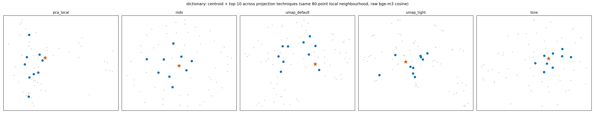
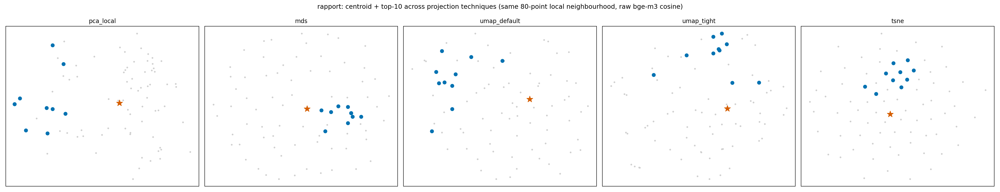
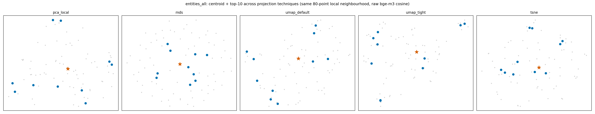

# Testing different dimension-projecting techniques

Data inventory: [`00_Available_Data.md`](00_Available_Data.md). Index: [`Results_Draft.md`](Results_Draft.md).
Follows from: [`02_Corpus_Centroids.md`](02_Corpus_Centroids.md).

## The question

Even after the centroid-plotting fixes in step 2 (jointly-fit UMAP, zoomed-in local
neighbourhood, then a positional-indexing bugfix), some groups still show the centroid star
sitting apart from its own top-10 nearest points, rather than inside them. Is that a failure
of UMAP specifically — would a different 2-D technique show it differently — or a real
property of the data that no 2-D picture can hide?

## Method

Same local neighbourhood (centroid + the 80 real points nearest it, raw bge-m3, cosine) for
three test groups — `dictionary`, `rapport` (worked well in step 2), `entities_all` — rendered
through **five** projection techniques side by side, all fit **jointly** on (local points +
centroid), never a real-points-only fit with the centroid merely projected in afterward:

- **pca_local** — linear PCA on just this local neighbourhood (a fresh local fit, not the old
  global-corpus PCA slice this toolkit already moved away from). The cheap linear baseline.
- **mds** — classical/metric multidimensional scaling on the actual cosine-distance matrix.
  The one technique here whose objective is literally *"make 2-D distances match the real
  distance matrix as closely as possible"* — unlike PCA (maximizes variance) or UMAP/t-SNE
  (preserve local neighbour topology, not metric distance). The most theoretically apt
  technique for this exact question.
- **umap_default** — same parameters step 2 uses (n_neighbors≈15, min_dist=0.1, cosine).
- **umap_tight** — min_dist=0.0, half the neighbours — tests whether more aggressive
  local-tightening parameters change the picture.
- **tsne** — cosine metric, perplexity capped below the sample size — the other standard
  neighbour-preserving nonlinear technique, often visually tighter than UMAP at the cost of
  distorting relative cluster sizes/distances more.

Code: `thesis_corpus/compare_projection_techniques.py`.

## Result

**All 5 techniques agree, for each group.** `dictionary`'s centroid sits reasonably embedded
among its top-10 in every technique; `rapport`'s top-10 form a tight sub-cluster **offset**
from the centroid in every technique; `entities_all`'s top-10 form a loose ring **around** the
centroid in every technique. Since MDS — built specifically to preserve real distances — shows
the same pattern as everything else, this rules out "bad projection choice" as the
explanation. It's a real fact about each group's geometry, not an artifact of how it's drawn.

## Why, quantified

Two distinct reasons a centroid's "10 nearest" can fail to look like a tight huddle around it
— checked directly on the data, not just eyeballed:

**`rapport`: the top-10 aren't much closer than average.** The whole group's typical
(mean) distance-to-centroid is 0.763, with the closest 10% of points already at 0.675. The
actual top-10 average 0.658 — closer, but only modestly so, not a dramatic outlier cluster.
The top-10 are mutually tight (spread of 0.485 around their own sub-centroid) but that
sub-cluster's center sits 0.434 from the true centroid — comparable to its own internal
spread. In plain terms: `rapport`'s 94 expressions don't have one dominant "typical" mode near
the mean; the nearest 10 are simply the least-atypical of a fairly dispersed set.

**`entities_all`: the top-10 aren't close to each other.** Mean pairwise cosine similarity
among `entities_all`'s own top-10 is 0.675 — noticeably lower than `dictionary`'s 0.726 or
`rapport`'s 0.728. They're each individually close to the centroid, from different directions,
without being similar to one another — a "shell" around the centroid, not a "ball." No 2-D
projection can make points on a shell look like a huddle without lying about the geometry.

## Conclusion

No further projection-technique work is warranted for this specific complaint — the centroid
plots in [`02_Corpus_Centroids.md`](02_Corpus_Centroids.md) are showing the truth as faithfully
as 2-D can. Where the centroid looks separated from its neighbours, that reflects the group's
actual shape (dispersed, or shell-like), not a plotting failure. MDS remains available as a
documented alternative to UMAP for the main plots if ever wanted, but did not produce a
materially different picture in this test.
