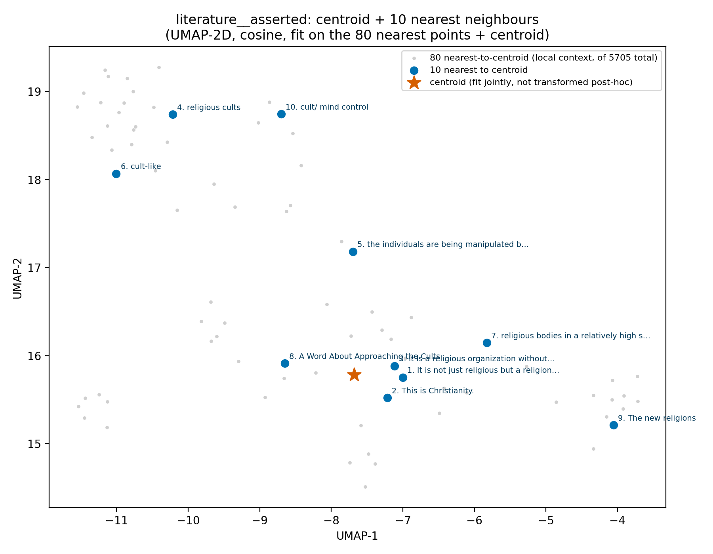
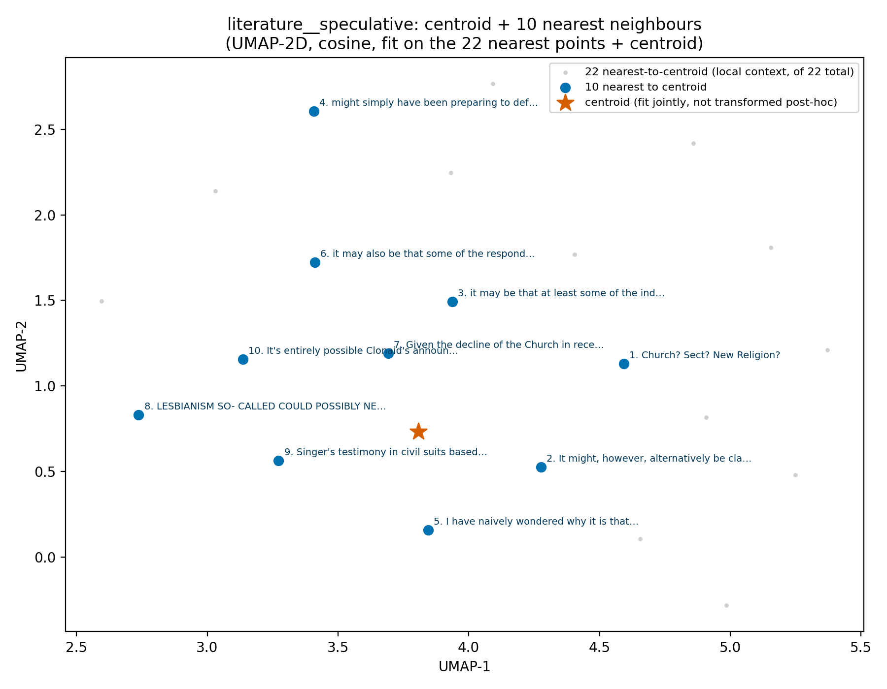
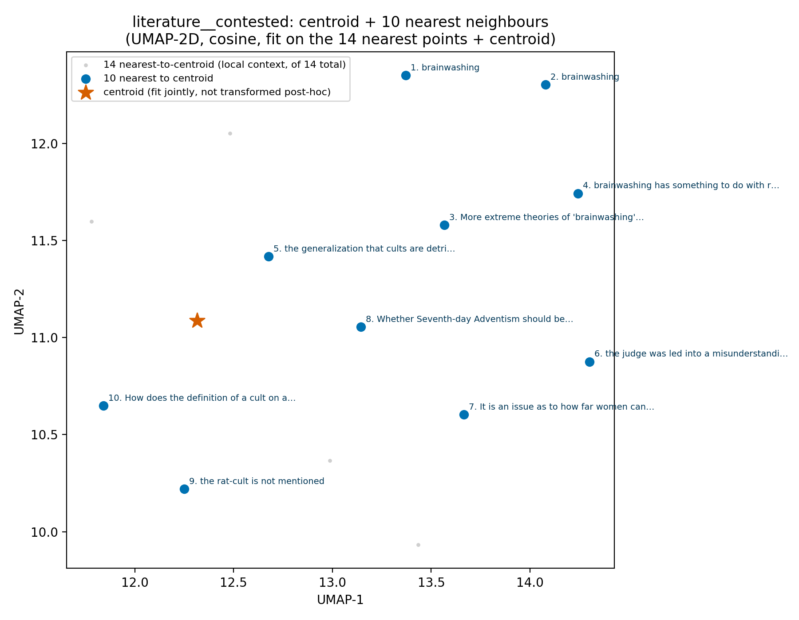
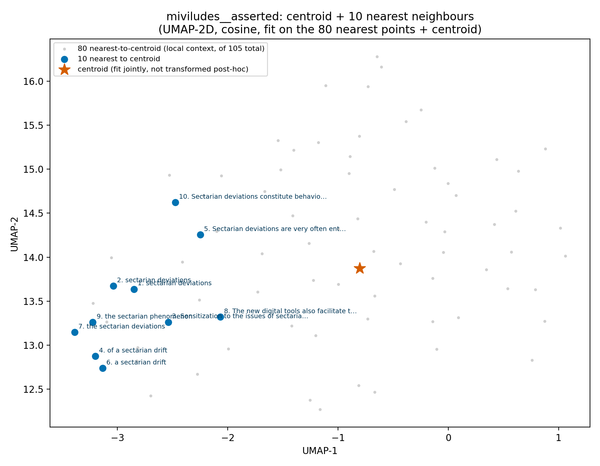
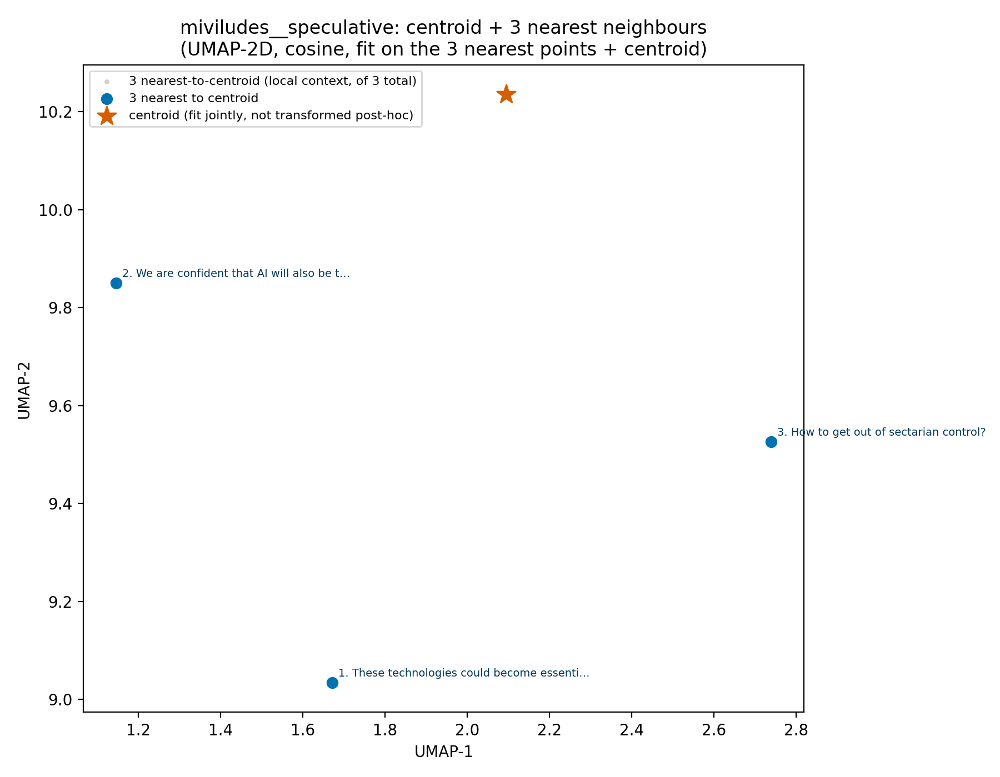
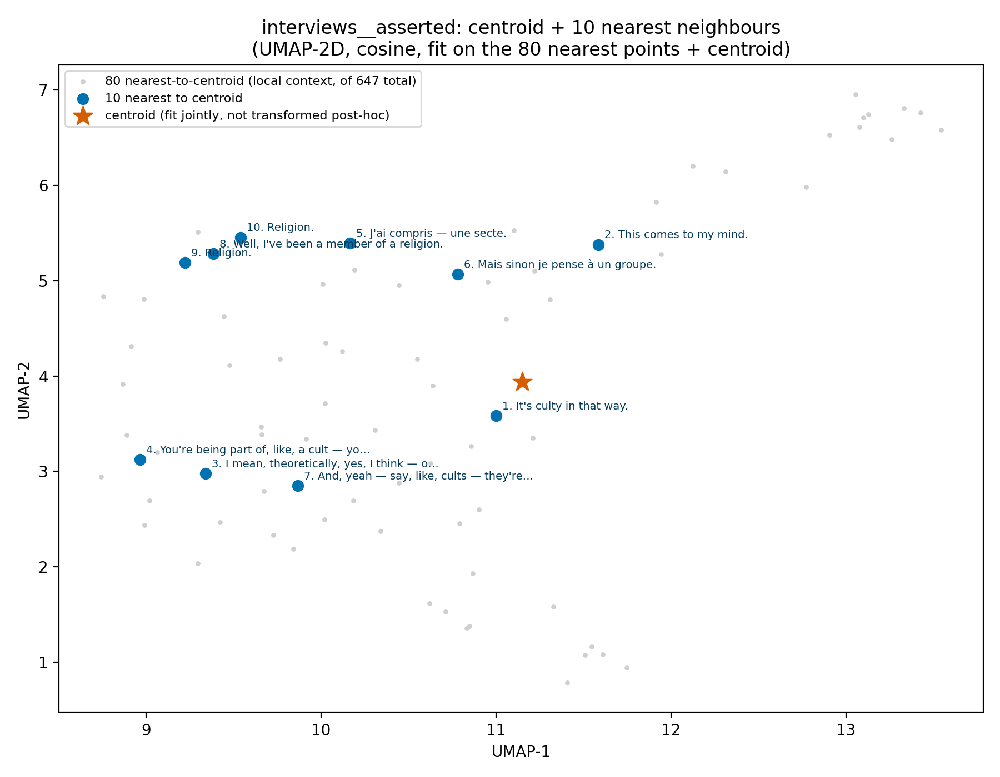
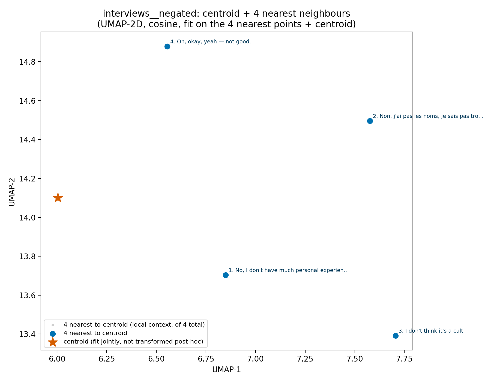
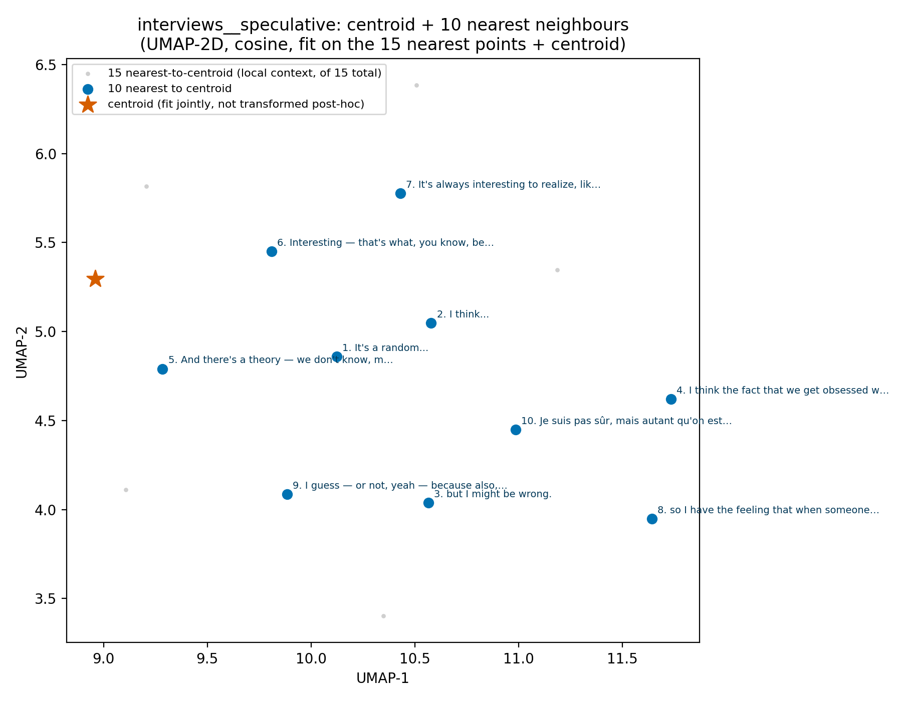

# Centroids by epistemic status

Data inventory: [`00_Available_Data.md`](00_Available_Data.md). Index: [`Results_Draft.md`](Results_Draft.md).
Same method as [`02_Corpus_Centroids.md`](02_Corpus_Centroids.md), split one level further.

Same centroid/nearest-neighbour method, split by `epistemic_status` within each of the three
expression corpora (literature/miviludes/interviews) — dynamically discovered per corpus
(never a hardcoded set of statuses), subgroups with fewer than 3 points skipped. Motivated by
a caveat in the index's Notes: geometric centrality reflects how much a term is *discussed*,
not whether the corpus affirms it — does splitting by status show *where* a contested term
like "brainwashing" actually lives?

## Confirmed finding

`literature__contested` (n=14, the smallest literature subgroup) has **"brainwashing" as its
own rank-1 AND rank-2 nearest neighbour**, with ranks 3–6 all explicitly about
brainwashing-as-a-debated-concept ("More extreme theories of 'brainwashing' have also been
debated", "the generalization that cults are detrimental to one's mental health is 'doubtful'",
"the judge was led into a misunderstanding, confusing Lifton's theory of totalism with the
CIA's hypotheses on brainwashing"). `literature__asserted` (n=5,705, 99.4% of the corpus)
centers on plain definitional statements instead, same as the whole-corpus centroid.

**So**: the whole-corpus centroid's "cult/brainwashing" (rank 10, see
[`02_Corpus_Centroids.md`](02_Corpus_Centroids.md)) is pulled disproportionately from a tiny
but real cluster of scholarly *contestation*, not from the corpus broadly asserting
brainwashing as fact. What started as a methodological caveat is now a checked finding.

| Group | n | Nearest-to-centroid (rank 1) |
|---|---|---|
| `literature__asserted` | 5,705 | "It is not just religious but a religion." |
| `literature__speculative` | 22 | "Church? Sect? New Religion?" |
| `literature__contested` | 14 | "brainwashing" |
| `miviludes__asserted` | 105 | "sectarian deviations" |
| `miviludes__speculative` | 3 | "These technologies could become essential for detecting sectarian drifts..." |
| `interviews__asserted` | 647 | "It's culty in that way." |
| `interviews__negated` | 4 | "No, I don't have much personal experience." |
| `interviews__speculative` | 15 | "It's a random..." |

Full data: [`data/centroid_neighbors.csv`](data/centroid_neighbors.csv).

---

### literature__asserted

1. It is not just religious but a religion .
2. This is Christianity.
3. It is a religious organization without a doubt.
4. religious cults
5. the individuals are being manipulated by a cunning and probably unscrupulous cult leader
6. cult-like
7. religious bodies in a relatively high state of tension with their environments
8. A Word About Approaching the Cults
9. The new religions
10. cult/ mind control

### literature__speculative

1. Church? Sect? New Religion?
2. It might, however, alternatively be classified as a cult, since it is not a primary source of identity for any of its members and since members of the English-language group are mostly members of the local cultic milieu, and even the international cultic milieu.
3. it may be that at least some of the individuals who exit continue to profit from the experiences in the group, especially from having come to know the ''living God'' and Jesus and having found faith.
4. might simply have been preparing to defend himself against an apocalyptic onslaught
5. I have naively wondered why it is that other scholars wonder if I am a witch, or a Charismatic Catholic
6. it may also be that some of the respondents had already gone through the worst of the process when interviewed.
7. Given the decline of the Church in recent years, it may well be that independent Scientologists will one day outnumber members of the Church of Scientology.
8. LESBIANISM SO- CALLED COULD POSSIBLY NECESSARILY BE A STOPGAP, A TEMPORARY INTERIM SOLUTION to a sexual need.
9. Singer's testimony in civil suits based on her brainwashing argument may constitute all by itself the most effective tactic of the anticult movement
10. It's entirely possible Clonaid's announcement is part of an elaborate hoax intended to bring publicity to the Raëlian movement.

### literature__contested

1. brainwashing
2. brainwashing
3. More extreme theories of 'brainwashing' have also been debated.
4. brainwashing has something to do with recruitment mechanisms
5. the generalization that cults are detrimental to one's mental health is 'doubtful.'
6. the judge was led into a misunderstanding, confusing Lifton ' s theory of totalism with the CIA ' s hypotheses on brainwashing
7. It is an issue as to how far women can be empowered in the context of absolute surrender to a male master.
8. Whether Seventh-day Adventism should be classified as an NRM or not is debatable.
9. the rat-cult is not mentioned
10. How does the definition of a cult on a Christian counter-cult site like Apologetics Index (www.apologeticsindex .com) differ from that used on secular anti-cult sites like the American Family Foundation (www.csj.org)?

### miviludes__asserted

1. sectarian deviations
2. sectarian deviations
3. Sensitization to the issues of sectarian deviations
4. of a sectarian drift
5. Sectarian deviations are very often entangled with other situations of violence and danger in which the minor is the victim.
6. a sectarian drift
7. the sectarian deviations
8. The new digital tools also facilitate the emergence and spread of sectarian deviations.
9. the sectarian phenomenon
10. Sectarian deviations constitute behaviors that, through various means—particularly by relying on beliefs or doctrines—aim to place individuals in a state of submission that results in multiple personal and financial damages.

### miviludes__speculative

1. These technologies could become essential for detecting sectarian drifts and extremist discourses.
2. We are confident that AI will also be this growth accelerator for the sectarian groups that will thus multiply the subjugated people.
3. How to get out of sectarian control?

### interviews__asserted

1. It's culty in that way.
2. This comes to my mind.
3. I mean, theoretically, yes, I think — or a sect would be a cult under a religious umbrella, probably.
4. You're being part of, like, a cult — you just think you're part of a community, or something like that.
5. J'ai compris — une secte.
6. Mais sinon je pense à un groupe.
7. And, yeah — say, like, cults — they're just like a really, really niche, small group that's against a topic.
8. Well, I've been a member of a religion.
9. Religion.
10. Religion.

### interviews__negated

1. No, I don't have much personal experience.
2. Non, j'ai pas les noms, je sais pas trop.
3. I don't think it's a cult.
4. Oh, okay, yeah — not good.

### interviews__speculative

1. It's a random...
2. I think...
3. but I might be wrong.
4. I think the fact that we get obsessed with it — if it's a very enclosed, non-welcoming community, it could make it feel like that — but I don't think there's a leader that we follow.
5. And there's a theory — we don't know, maybe it's a conspiracy theory — that some of them, like Charles Manson, started a cult, or like, uh, Brian Jones.
6. Interesting — that's what, you know, because of the movies, I'd say?
7. It's always interesting to realize, like, how did it get there?
8. so I have the feeling that when someone decides to join a cult, they might not even call it a cult, actually — because I also feel the name itself comes with a negative connotation.
9. I guess — or not, yeah — because also, there was no reason to kill them, but he did it anyway.
10. Je suis pas sûr, mais autant qu'on est sûr que Dieu existe, ou Allah existe, ou Yahvé existe.

