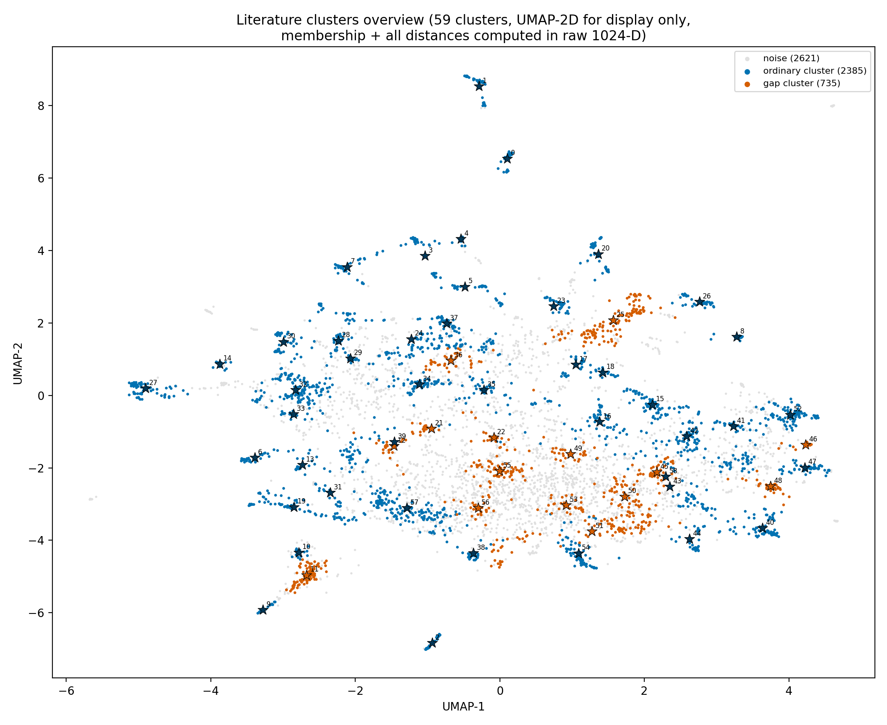

# Literature clusters + entity coverage gaps

Data inventory: [`00_Available_Data.md`](00_Available_Data.md). Index: [`Results_Draft.md`](Results_Draft.md).

First run of the clustering step proposed and agreed in the index's "Planned next" section.
Clusters the 5,741 literature expressions (raw bge-m3, same reasoning as
[`02_Corpus_Centroids.md`](02_Corpus_Centroids.md)) into concepts, gives each its own
representative "binding expression," and checks each concept's distance to the nearest named
entity — including flagging concepts with no nearby entity at all.

## Method

**Clustering algorithm**: HDBSCAN (`sklearn.cluster.HDBSCAN`), reusing
`analyze_entity_topology.py`'s own `compute_clusters` unmodified — no need to pick a cluster
count upfront, handles variable-density clusters, and leaves genuinely unclustered points as
noise (label `-1`) rather than forcing every expression into some bucket.

**Clustered in a 12-D UMAP reduction, not raw 1024-D — checked, not assumed, and understood
mechanistically, not just empirically.** HDBSCAN directly on the raw vectors was swept across
`min_cluster_size` ∈ {5, 8, 10, 15}: noise ratio was 84.5–92.6% every time, and — tellingly —
got *worse*, not better, as `min_cluster_size` rose. HDBSCAN's method depends on detecting
density *contrast*: regions measurably denser than their surroundings. In 1024 raw dimensions,
pairwise distances tend to concentrate (the gap between "nearest-neighbour distance" and
"typical distance" shrinks as dimensionality grows) — bge-m3 embeddings sit on a real semantic
manifold, not a random cloud, so this doesn't hit the theoretical worst case, but 1024
dimensions still carry a lot of variance that isn't semantically discriminative for clustering
(sentence length, phrasing style, tokenization quirks), and that dilutes the topical signal
enough to flatten local density differences. HDBSCAN's core distances end up large and
near-uniform across most points as a result, so almost no candidate grouping is *persistent*
(stable across a range of density thresholds) enough to survive cluster extraction — exactly
consistent with noise getting worse, not better, as denser candidate clusters were demanded.
A 12-D UMAP pre-reduction (cosine metric, `min_dist=0.0` — tight packing for a density-based
clusterer, unlike the `0.1` used for visualization) explicitly optimizes to preserve *local
neighbourhood topology*, restoring exactly the density contrast HDBSCAN needs — not a
workaround specific to this project, but the reason tools like BERTopic always reduce before
clustering. It brought noise down to 40–46% at comparable `min_cluster_size` values. **The
reduction is used only to decide cluster membership** — every centroid, distance, and
nearest-neighbour computation below still runs on the real, raw 1024-D vectors, same standing
rule as the rest of this toolkit (pictures/reductions are a reading aid, real distances come
from the full space). The semantic structure was there in the raw vectors all along — the
post-reduction clusters came out very clean (Heaven's Gate at 0.985 cosine similarity to its
own cluster) — it just wasn't *detectable* by a density method operating directly in the noisy
ambient space.

**Final run**: `min_cluster_size=20` → **59 clusters**, sizes 20–143 (median 45), **45.7% of
literature (2,621/5,741 expressions) left as noise** — real expressions that didn't sit inside
any density-defined cluster at this granularity, not "unimportant" ones.

*UMAP-2D, for display only — a separate, fresh fit from the 12-D clustering reduction above,
never used for any actual distance/membership computation. Gap clusters (orange) visibly sit
mostly in the undifferentiated central mass together with noise; ordinary clusters (blue) tend
to form distinct peripheral satellites — visually consistent with the pattern below (gaps are
mostly abstract/theoretical discourse, ordinary clusters mostly concrete named-group
discourse).*

**Binding expression**: the 8 real expressions nearest each cluster's *own* centroid,
candidates restricted to that cluster's own members — an actual sentence from the corpus, not
a generated summary (`cluster_summary.csv` keeps just the first 3; full 8 in
`cluster_binding_expressions.csv`).

**Entity relationship** (candidate pool: `entities_literature`, entities actually mentioned by
the literature corpus, n=3,759): for each cluster, its 10 nearest entities; for each entity, its
single nearest cluster (inverse assignment); clusters at or above the 75th percentile of
nearest-entity distance flagged as **entity gaps** — concepts with no nearby named referent.

Code: `thesis_corpus/analyze_literature_clusters.py`.

## Result: entity coverage is real but very uneven

Entities did NOT spread evenly across clusters. Of 3,759 entities, **2 of the 59 clusters
absorb 49% of them** — cluster 25 (*"Rissho Kōseikai" / "Soka Gakkai"*, itself flagged a gap —
see below) and cluster 35 (*"The New Organization" / "New Thought"*) — both discourse regions
about *naming specific movements*, which is exactly where named-entity mentions concentrate.
The rest of the entity mass spreads thinly across the other 57 clusters. This is a sanity check
that passed: entity-dense clusters are, as expected, the ones actually talking about specific
named groups.

## The clusters, full list (sorted by size)

Cosine similarity is between the cluster's own centroid and its single nearest entity — higher
means a specific named group sits right at the center of that concept; lower means even the
closest entity is a loose match. 15 of 59 clusters (25%, the top quartile by nearest-entity
distance) are flagged **gap**.

| ID | Size | Binding expression | Nearest entity | Cosine sim | Gap |
|---|---|---|---|---|---|
| 57 | 143 | new religious movements | understanding new religious movements | 0.825 |  |
| 24 | 141 | the Muslim Brotherhood | islamists | 0.795 |  |
| 25 | 134 | Rissho ¯ Ko ¯seikai | so ¯ka gakkai | 0.751 | **gap** |
| 32 | 129 | the Church of Jesus Christ of Latter-day Saints | the church of jesus christ of latter-day saints | 0.873 |  |
| 52 | 117 | cults | ufo cults | 0.858 |  |
| 51 | 97 | We don't approach/go towards the groups, we do not have the time. | anonymous | 0.643 | **gap** |
| 11 | 86 | NRMs are religions. | nrms | 0.767 | **gap** |
| 40 | 85 | brainwashing | brainwashing | 0.872 |  |
| 19 | 82 | New Age movement | the new age movement | 0.889 |  |
| 27 | 82 | the Unification Church | the unification church | 0.952 |  |
| 54 | 76 | charismatic leadership and authority | charismatic authority | 0.865 |  |
| 15 | 75 | Satanism | satanism | 0.859 |  |
| 42 | 73 | sects | sectes | 0.827 |  |
| 34 | 64 | The Theosophical Society | theosophical society | 0.889 |  |
| 55 | 63 | This is Christianity. | god is love | 0.720 | **gap** |
| 1 | 60 | the Branch Davidians | the branch davidians | 0.889 |  |
| 47 | 60 | anti-cult movement | the anti-cult movement | 0.867 |  |
| 30 | 59 | The Family (formerly the Children of God) | the family (formerly the children of god) | 0.910 |  |
| 43 | 59 | mental manipulation | coercive persuasion | 0.789 |  |
| 20 | 57 | Osho, founder of the Rajneesh Movement | rajneesh movement | 0.832 |  |
| 39 | 56 | New Religious Movements | new religious movements | 0.900 |  |
| 5 | 55 | the International Society for Krishna Consciousness (ISKCON) | the international society for krishna consciousness | 0.868 |  |
| 16 | 54 | Wicca is a tradition in its own right | wicca | 0.783 |  |
| 58 | 54 | The major criterion of the concept of cult is its oppositional nature: A cult is a group that has beliefs and/or practices that are counter to those of the dominant culture. | comprehending cults | 0.775 |  |
| 37 | 53 | The Family | the family | 0.917 |  |
| 26 | 50 | Aum Shinrikyo | aum shinrikyo | 0.933 |  |
| 50 | 49 | Male Left leadership [in other groups] seemed pompous and uncaring. | yelling | 0.662 | **gap** |
| 0 | 47 | the Peoples Temple | the peoples temple | 0.943 |  |
| 23 | 46 | Sathya Sai Baba | sathya sai baba | 0.833 |  |
| 45 | 45 | The group has catastrophic millennial and dualistic beliefs that expect and promote conflict. | how the millennium comes violently | 0.693 | **gap** |
| 2 | 44 | The Church of Scientology | the church of scientology | 0.959 |  |
| 7 | 44 | the Solar Temple | the solar temple | 0.952 |  |
| 35 | 43 | The New Organization | new thought | 0.799 |  |
| 6 | 42 | the Raelian religion | raelian religion | 0.875 |  |
| 44 | 42 | deprogramming | deprogramming | 0.860 |  |
| 36 | 40 | the Family Federation for World Peace and Unification | american family foundation | 0.750 | **gap** |
| 9 | 39 | NRMs | nrms | 0.970 |  |
| 28 | 39 | the Order of the Solar Temple | order of the solar temple | 0.861 |  |
| 48 | 39 | the ' cults ' apply real ' brainwashing. | conversion and 'brainwashing' in new religious movements | 0.754 | **gap** |
| 3 | 32 | the 'suicide cult', Heaven's Gate | the heaven's gate suicides | 0.879 |  |
| 53 | 31 | it is a multidimensional process in which both individual and group have some degree of influence | self transformation | 0.671 | **gap** |
| 56 | 30 | It is not just religious but a religion . | christian faith | 0.695 | **gap** |
| 38 | 29 | Scientology is a religion - and it certainly functions as a religion in the lives of most members of the Church of Scientology | what is scientology? | 0.772 |  |
| 41 | 29 | the cultic milieu | cultic milieu | 0.919 |  |
| 17 | 28 | Sahaja Yoga is an example. | sahaja yoga | 0.836 |  |
| 22 | 28 | There are around 800,000 followers in total in various countries. | joining new religious movements | 0.602 | **gap** |
| 49 | 28 | The human being is a part of nature. | snapping | 0.716 | **gap** |
| 10 | 25 | new religious movements (NRMs) | new religious movements (nrms) | 0.964 |  |
| 14 | 23 | Christian Science | christian science | 0.939 |  |
| 18 | 23 | Mama Ji Sarkar is respected by his devotees as having been a true majzub | the majzub mama ji sarkar | 0.780 |  |
| 21 | 23 | The Aquarian Conspiracy (1980) | moral re-armament | 0.684 | **gap** |
| 33 | 23 | African Independent Churches | african independent churches | 0.862 |  |
| 4 | 21 | Heaven's Gate | heaven's gate | 0.985 |  |
| 8 | 21 | Falun Gong | falun gong | 0.937 |  |
| 12 | 21 | Godianism is a neo-African traditional movement with its Head Office in Nigeria. | godianism | 0.731 | **gap** |
| 31 | 21 | Neo-paganism | neo- pagan | 0.873 |  |
| 46 | 21 | destructive cults | satanic cults | 0.756 | **gap** |
| 13 | 20 | New Religious Movements (NRMs) | new religious movements (nrms) | 0.923 |  |
| 29 | 20 | The Rosicrucian Fellowship | rosicrucian order | 0.849 |  |

## The pattern in the gaps

The 15 gap clusters sort into six distinct types, not one undifferentiated bucket:

1. **Entity-extraction near-misses** — a real named group, but the entity extraction's nearest
   match is a slightly wrong form: **25** (Rissho Kōseikai/Soka Gakkai — the nearest entity
   "so ¯ka gakkai" carries a stray diacritic-driven space, an OCR/transcription artifact, not a
   real conceptual gap), **12** (Godianism — nearest entity is literally "godianism" at 0.731,
   arguably not even a gap, just below the p75 cutoff), **36** (Family Federation for World
   Peace and Unification — the correct entity sits at rank **2** (0.741); rank 1 is a critic
   organization, "American Family Foundation," a real but narrow near-miss).
2. **Generic pejorative/category phrases, not about one specific thing** — **46** ("destructive
   cults" repeated 7 of 8 times verbatim; nearest entity is another generic category, "satanic
   cults," 0.756), **48** ("cult/brainwashing" in various phrasings; nearest entities are
   *article titles about the brainwashing debate*, not a named group).
3. **Abstract/theoretical/definitional discourse — genuine conceptual gaps** — **11** (NRMs as
   an analytic category: "NRMs are religions"), **51** (definitional negation — what a
   religion/cult *isn't*: "it has so few of the aspects of a religion, no hierarchy..."), **55**
   (abstract religious/theological language: "This is Christianity," sainthood, divinity),
   **45** (a named theoretical framework, *catastrophic millennialism*, with real specificity
   but no group attached to it), **53** (process theory: "a multidimensional process in which
   both individual and group have some degree of influence"), **56** (religion-vs-science
   epistemology: "No science can stand alone. It needs religion to make it meaningful").
4. **Statistical/quantitative claims** — **22** (membership counts across many different
   groups pooled into one "numbers of followers" register: "around 800,000 followers," "1,500
   members," "130 million members worldwide").
5. **Behavioural/attitudinal description not tied to one group** — **50** (critical
   descriptions of leadership conduct: "Male Left leadership... seemed pompous and uncaring,"
   "the corrupt and arbitrary nature of their leader"), **49** (a heterogeneous, looser
   cluster — "The human being is a part of nature," "The Work is being completed" — fragments
   that share a register more than a topic).
6. **Book/publication titles, not group names** — **21** (*The Aquarian Conspiracy*, *The
   Spiral Dance*, *The Molecules of Emotion* — New Age-adjacent book titles; the entity
   extraction targets named groups/people, not publications, so this register has structurally
   no matching entity type, not a coverage failure).

**Reading this**: about half the flagged gaps (types 3–6, 10 of 15) are genuine — a register
this corpus's entity extraction was never going to anchor to a name, because there isn't one
(abstract theory, statistics, book titles, generic pejoratives). The other third (types 1–2,
5 of 15) are narrower: either literal near-misses in the entity extraction (25, 12, 36) or
generic category phrases sitting near other generic category phrases rather than a true
conceptual void (46, 48). Consistent with the earlier finding that literature's own overall
centroid sits on definitional statements (see [`02_Corpus_Centroids.md`](02_Corpus_Centroids.md)):
this cluster-level view shows concretely *which* parts of that definitional register have no
anchor at all, and separates that from simple extraction noise.

## Gap clusters in detail

For each of the 15, its full 8 binding expressions (not just the top 3 shown in the main
table) and its full 10 nearest entities (not just the top 1) — enough to read what's actually
in the cluster, not just its single representative sentence. Ordered by size, largest first.

### Cluster 25 (size 134, nearest-entity cosine similarity 0.751) — *near-miss, type 1*

**Binding expressions:**
1. Rissho ¯ Ko ¯seikai
2. Soka Gakkai
3. Soka Gakkai
4. Soka Gakkai
5. Soka Gakkai
6. Soka Gakkai o Kiru
7. Byakkô Shinkô Kai
8. Naganuma Myôkô

**Nearest entities:** so ¯ka gakkai (0.751) · soka gakkai (0.740) · sekai kyuseikyo (0.732) ·
sekai kyusei kyo (0.719) · i (0.716) · self (0.713) · ikeda daisaku (0.712) · kurozumikyo
(0.712) · mau mau (0.707) · daisaku ikeda (0.706)

### Cluster 51 (size 97, nearest-entity cosine similarity 0.643) — *definitional negation, type 3*

**Binding expressions:**
1. We don't approach/go towards the groups, we do not have the time.
2. the religious experience under consideration is not genuine
3. it has so few of the aspects of a religion, no hierarchy, no membership system, no structure, not even a network connecting regions or neighborhoods
4. None of these reports is systematic in nature.
5. There is no dogma, no orthodoxy, and essentially, no agreement on where the boundaries of the movement are and who is or is not part of it.
6. There is no sexual element, and children are never mentioned, much less abused
7. They have a left-wing political agenda that we don't have.
8. the rat-cult is not mentioned

**Nearest entities:** anonymous (0.643) · doctrine over person (0.622) · aum shinrikyō (0.621) ·
self-religion (0.609) · misunderstanding cults (0.598) · asahara shōkō (0.597) · metsubō no hi
(0.590) · silence (0.590) · secularization (0.588) · total overcomers anonymous (0.587)

### Cluster 11 (size 86, nearest-entity cosine similarity 0.767) — *category-level discourse, type 3*

**Binding expressions:**
1. NRMs are religions.
2. NRMs are simply caught up in a process which affects all religious collectivities.
3. Various NRMs share beliefs and practices that tie them to certain religious traditions.
4. NRMs may attract people who are rigid on religious and socio-moral issues, submissive and conformist.
5. NRMs may attract people who are rigid on religious and socio-moral issues, submissive and conformist.
6. NRMs-as new, radical, and marginalized groups-are prone to underline the absolute character of their truth, and the non-negotiable character of their ideas, beliefs, and practices.
7. NRMs-as new, radical, and marginalized groups-are prone to underline the absolute character of their truth, and the non-negotiable character of their ideas, beliefs, and practices.
8. NRMs may challenge, for example, prevailing sociological ideas about secularisation, the dilemmas of the liberal state, the limits of tolerance in democratic societies, the processes of religious conversion, the routinisation of charisma, and so on.

**Nearest entities:** nrms (0.767) · gender and nrms (0.760) · new religious movements (nrms)
(0.750) · conversion to nrms (0.718) · eastern-based nrms (0.699) · nrm (0.689) · nrm members
(0.682) · japanese nrms (0.672) · new religions studies (nrs) (0.649) · nrp (0.600)

### Cluster 55 (size 63, nearest-entity cosine similarity 0.720) — *abstract theological language, type 3*

**Binding expressions:**
1. This is Christianity.
2. The bodies of saints are enormously powerful.
3. The Christ is now here.
4. The saint is a remote figure, revered, feared and respected.
5. the Holy Spirit clearly speaking to us once again
6. the inner man is Divine, is fully Divine . . .
7. The sacred text is thus intimately connected to the individual who provided it.
8. This is the story of the death of a saint.

**Nearest entities:** god is love (0.720) · secure attachment to god (0.711) · christian faith
(0.691) · the gods have landed (0.681) · baptism in the holy spirit (0.677) · holy wine
ceremony (0.669) · healing (0.663) · the church universal and triumphant (0.663) · god (0.660) ·
in gods we trust (0.659)

### Cluster 50 (size 49, nearest-entity cosine similarity 0.662) — *leadership-behaviour description, type 5*

**Binding expressions:**
1. Male Left leadership [in other groups] seemed pompous and uncaring.
2. a very controlling environment existed in both as well.
3. The way they looked, the way they presented themselves was otherworldly, I guess you would say.
4. the corrupt and arbitrary nature of their leader, and the collusion of the inner circle
5. They were frightened and in fear of going to jail
6. the leadership instigated purges and orchestrated tests to weed out less committed members and those who could not withstand the pressure.
7. The world was considered to be corrupt, unjust, and doomed, and they felt rejected by it.
8. People who lacked a strong sense of boundaries, or conversely, were too rigid and set in their ways, were deemed unsuitable.

**Nearest entities:** yelling (0.662) · their blood cries out (0.633) · satanic scare (0.627) ·
concerned relatives (0.618) · doctrine over person (0.618) · conscientious objection (0.612) ·
coercive persuasion (0.609) · satanic abuse (0.607) · submissiveness (0.604) · brainwashing
(0.601)

### Cluster 45 (size 45, nearest-entity cosine similarity 0.693) — *named theory, no group attached, type 3*

**Binding expressions:**
1. The group has catastrophic millennial and dualistic beliefs that expect and promote conflict.
2. Some millennialists expect the transition to be accomplished catastrophically (catastrophic millennialism).
3. Catastrophic millennialism involves a radical dualism that expects conflict and can even promote it.
4. catastrophic millennialism
5. I use 'apocalypticism' as a synonym for catastrophic millennialism.
6. apocalyptic millennialism constitutes a powerful and volatile mixture
7. Catastrophic millennialists who live in isolated communities are inherently in tension with mainstream society.
8. Catastrophic millennialism is generally associated with a 'pessimistic evaluation of human nature and society.'

**Nearest entities:** how the millennium comes violently (0.693) · millennialism (0.657) ·
millenarianism (0.642) · conscientious objection (0.638) · millennium, messiahs, and mayhem
(0.623) · yelling (0.622) · moral panics (0.622) · radical departures (0.620) · satanic scare
(0.612) · concerned relatives (0.610)

### Cluster 36 (size 40, nearest-entity cosine similarity 0.750) — *near-miss, type 1*

**Binding expressions:**
1. the Family Federation for World Peace and Unification
2. the United Front Against Fascism
3. the Association pour la Defense de la Familie et de l'Individual (ADFI)
4. The Freedom Socialist Party
5. the Association pour la Défense de la Familie et de l'Individual (ADFI)
6. American Family Foundation
7. American Family Foundation
8. American Family Foundation (AFF)

**Nearest entities:** american family foundation (0.750) · family federation for world peace
and unification (0.741) · citizens' freedom foundation (0.734) · american family foundation
(aff) (0.734) · freedom of thought foundation (0.728) · society (0.720) · workers party (0.719) ·
self (0.715) · citizens freedom foundation (0.709) · democratic workers party (0.705)

### Cluster 48 (size 39, nearest-entity cosine similarity 0.754) — *generic phrase, type 2*

**Binding expressions:**
1. the 'cults' apply real 'brainwashing.
2. cult/brainwashing
3. cultic brainwashing theory
4. cults use brainwashing, hypnosis, thought reform, coercive persuasion, or indoctrination
5. cults use brainwashing, hypnosis, thought reform, coercive persuasion, or indoctrination
6. the 'brainwashing' of cult converts
7. so-called cult/brainwashing cases
8. cult/mind control ideology

**Nearest entities:** conversion and 'brainwashing' in new religious movements (0.754) · a
social psychological critique of 'brainwashing' claims about recruitment to new religions
(0.752) · satanic cults (0.751) · ufo cults (0.747) · brainwashing (0.723) · ufo cult (0.712) ·
cults: faith, healing, and coercion (0.711) · comprehending cults (0.704) · cultic milieu
(0.688) · misunderstanding cults (0.687)

### Cluster 53 (size 31, nearest-entity cosine similarity 0.671) — *process theory, type 3*

**Binding expressions:**
1. it is a multidimensional process in which both individual and group have some degree of influence
2. sufficient condition for achieving acceptability in the long run.
3. requiring a high degree of conformity and commitment.
4. Get the person to drastically reinterpret his or her life's history and radically alter his or her worldview and accept a new version of reality and causality.
5. a minimum of six months is estimated as necessary before an adequate readjustment can be made to the 'real' world, a genuine appreciation of its qualities, and a sense that the group is no longer a need or a threat
6. The 'relief effect' is thus mediated by the affiliative attitudes of social cohesiveness and shared beliefs-that is, by both social and cognitive modalities.
7. lack of autonomy and flexibility is the price to be paid for re-establishing quality in relationships, order and structure in meaning, equilibrium in mood, and optimism for the future against depressive tendencies
8. The movement is a 'total institution', regulating all its adherents' activities, programming all of their day but for the briefest periods of recreation or private time.

**Nearest entities:** self transformation (0.671) · conscientious objection (0.658) ·
submissiveness (0.657) · loading the language (0.652) · conformity (0.644) · the consciousness
reformation (0.634) · mind (0.627) · mind dynamics (0.624) · doctrine over person (0.623) ·
self-direction (0.623)

### Cluster 56 (size 30, nearest-entity cosine similarity 0.695) — *religion-vs-science epistemology, type 3*

**Binding expressions:**
1. It is not just religious but a religion.
2. The conspicuous ability to subject science to religious interpretation and use.
3. No science can stand alone. It needs religion to make it meaningful.
4. religion legitimates social institutions by bestowing upon them an ultimately ontological status, that is, by locating them within a sacred and cosmic frame of reference
5. a system that claims to embrace the essential truth underlying all systems of religion, philosophy, and science
6. a degree of respect to that which is numinous and beyond our normal way of understanding, and for God's sake, beyond only the 'good scholarly way!
7. Invention plays a part in all religions and is linked to other conceptual lenses, including syncretism and legitimation.
8. The absolute insistence that the only acceptable, moral epistemology is the material one of science bears more than a passing resemblance to fundamentalist religious responses to the modern world.

**Nearest entities:** christian faith (0.695) · understanding the new religions (0.673) · the
future of religion (0.668) · comprehending cults (0.665) · the church universal and triumphant
(0.656) · church of religious science/science of mind (0.654) · religious science (0.652) ·
secure attachment to god (0.651) · the new religious consciousness (0.645) · faith (0.644)

### Cluster 22 (size 28, nearest-entity cosine similarity 0.602) — *membership statistics, type 4*

**Binding expressions:**
1. There are around 800,000 followers in total in various countries.
2. The movement has around 1,500 members and is actively proselytizing.
3. The movement claims to have at the time of writing more than 130 million members worldwide.
4. New Acropolis is now active in fortytwo countries, with some 20,000 members.
5. It claims to have some 15 million followers worldwide, although this is unproven.
6. Agonshu now has a modest following of between one hundred and one thousand members in several countries of the Far East, Asia, and Africa.
7. Eckankar claims to have tens of thousands of members worldwide, many of whom also continue to be members of other religions.
8. In 2001 between 1,000 and 1,600 members remain.

**Nearest entities:** joining new religious movements (0.602) · christian community (0.581) ·
christian groups (0.574) · new age groups (0.573) · older members (0.571) · shaker communities
(0.570) · i am movement (0.563) · understanding new religious movements (0.563) · exploring new
religions (0.560) · the international society for krishna consciousness (0.558)

### Cluster 49 (size 28, nearest-entity cosine similarity 0.716) — *heterogeneous fragments, type 5*

**Binding expressions:**
1. The human being is a part of nature.
2. The Work is being completed.
3. He can see behind the faces of people.
4. a middle position
5. the imitating multitude
6. the Class was on the road
7. This report is part of a work in progress.
8. Extraction is the goal

**Nearest entities:** snapping (0.716) · demonstration (0.714) · loading the language (0.711) ·
latihan (0.688) · yelling (0.674) · drawing down the moon (0.673) · time (0.661) · a course in
miracles (0.658) · the training of the cadre (0.658) · a time to chant (0.657)

### Cluster 21 (size 23, nearest-entity cosine similarity 0.684) — *book titles, type 6*

**Binding expressions:**
1. The Aquarian Conspiracy (1980)
2. The Aquarian Conspiracy: Personal and Social Transformation in the 1980s
3. The Molecules of Emotion (1998)
4. The Spiral Dance (1989)
5. The Power is Within You (1991)
6. The Human Process for Enlightenment and Freedom (1972)
7. How to be Chic, Fabulous and Live Forever (1990)
8. Such titles as How to Become a Millionaire (1992) and Heavenly Power Defeats Illness (1992) are good examples of these tendencies.

**Nearest entities:** moral re-armament (0.685) · coercive persuasion (0.669) · getting saved
from the sixties (0.668) · the consciousness reformation (0.663) · the process (0.662) · self
transformation (0.651) · expanding universes (0.650) · the spiral dance (0.646) · a course in
miracles (0.645) · the science of mind (0.645)

### Cluster 12 (size 21, nearest-entity cosine similarity 0.731) — *near-miss, borderline, type 1*

**Binding expressions:**
1. Godianism is a neo-African traditional movement with its Head Office in Nigeria.
2. Godianism propagates African Traditional Religion
3. Godianism actively organizes a panAfrican revival of traditional religion and culture
4. Godianism, founded by Chief K.O.K.Onyioha in Nigeria, as the religious wing of the National Council of Nigeria and the Cameroons.
5. the Kenyan neo-traditionalist movement, Mungiki
6. Godianism
7. Godianism

**Nearest entities:** godianism (0.731) · goddess movement (0.642) · unificationist movement
(0.595) · african initiated churches (0.593) · kabbalism (0.593) · unificationism (0.592) ·
joining new religious movements (0.587) · kimbanguism (0.586) · kimbanguist church (0.586) ·
buddhahood (0.585)

### Cluster 46 (size 21, nearest-entity cosine similarity 0.756) — *generic phrase, type 2*

**Binding expressions:**
1. destructive cults
2. destructive cults
3. destructive cults
4. destructive cults
5. destructive cults
6. destructive cults
7. destructive cults
8. destructive cult

**Nearest entities:** satanic cults (0.756) · ufo cults (0.709) · ufo cult (0.701) · cult
(0.650) · satanic groups (0.644) · the chaos of cults (0.639) · comprehending cults (0.638) ·
satanic rituals (0.634) · sufi cults (0.632) · cults (0.632)

## Data

- [`data/cluster_summary.csv`](data/cluster_summary.csv) — one row per cluster: size, internal
  dispersion, distance to the literature grand centroid, top-3 binding expressions, nearest
  entity + distance/similarity, gap flag.
- [`data/cluster_binding_expressions.csv`](data/cluster_binding_expressions.csv) — full top-8
  binding expressions per cluster (cluster_summary.csv keeps only the first 3).
- [`data/cluster_nearest_entities.csv`](data/cluster_nearest_entities.csv) — full top-10
  nearest entities per cluster (not just rank-1).
- [`data/entity_nearest_cluster.csv`](data/entity_nearest_cluster.csv) — the inverse: for each
  of the 3,759 entities, its single nearest cluster.

## Not yet done

**Voronoi visualization**, per the original plan — a tessellation seeded by these 59 cluster
centroids, following `generate_voronoi_projections.py`'s existing pattern for entity clusters.
Held for after this numeric pass is reviewed, per the original "Planned next" ordering.

## Deductions and further analysis

**The field's own biggest topic is arguing about what to call things.** The two largest
clusters after the "specific named movement" ones are **57** ("new religious movements,"
n=143) and **52** ("cults," n=117) — both genuine prose discourse (not index entries, see
below), both spread across many different source documents rather than dominated by one or two
books (e.g. cluster 57 draws from 6+ books with no single source over 26 of 143 members). The
literature's single largest recurring activity, geometrically, is debating the terms
"new religious movement" and "cult" themselves — consistent with, and now more specific than,
the earlier finding that literature's overall centroid sits on definitional statements.

**Cluster 24 looked topical ("the Muslim Brotherhood") but turned out to be a genre cluster, not
a topic cluster — checked by inspecting its actual membership, not just its binding
expression.** Its binding expression is "the Muslim Brotherhood," but a random sample of its
141 members reads: "White Eagle Lodge," "Luciferians," "Nation of Islam," "Rastafarians,"
"Wahhabi Fundamentalist," "Christaquarians," "the Alawiyya" — bare proper-noun *index entries*,
not sentences about any one group. Its source documents confirm this: dominated by
reference-work encyclopedias (Clarke's *Encyclopedia of New Religious Movements*, Chryssides'
*A to Z of New Religious Movements*, Melton's *Encyclopedic Handbook of Cults in America* — 35,
14, and 7 of its members respectively). **This is a genuinely useful nuance for reading the
full cluster list**: at least one of the 59 "concept clusters" is actually a *text-genre*
cluster (alphabetical-index-style name lists) that happens to land near named-group discourse
geometrically, not a topical cluster about Islam or the Muslim Brotherhood specifically — a
reminder that HDBSCAN clusters on whatever makes embeddings land close together, which can be
surface format as much as topic.

**This reconciles an earlier finding rather than just adding to it.** [`02_Corpus_Centroids.md`](02_Corpus_Centroids.md)
found literature's overall entity-centroid sits on identity/psychology vocabulary (self, faith,
society) rather than named groups — puzzling on its own, since the literature clearly does
discuss named groups extensively. The entity-concentration result above explains why: 49% of
all 3,759 entities sit in just 2 of 59 clusters (25, 35 — both "naming a specific movement"
registers), while the numerically dominant prose-discourse clusters (57, 52, 11, and the gap
clusters) are comparatively entity-sparse. The corpus's entity layer is lopsided in exactly the
same way its expression layer is: a small, concrete, entity-dense region and a much larger,
abstract, entity-sparse one — the same underlying shape read from two different angles.

**"Brainwashing" splits into two distinct geometric registers, not one.** Cluster **40**
("brainwashing," n=85, cosine similarity 0.872 to its nearest entity, *not* flagged a gap) and
cluster **48** ("cult/brainwashing" as a repeated stock phrase, n=39, cosine similarity 0.754,
flagged a gap) are different clusters. This adds a layer to
[`05_Epistemic_Status_Centroids.md`](05_Epistemic_Status_Centroids.md)'s finding that
"brainwashing" is central because it's *contested*: there isn't one undifferentiated
"brainwashing discourse" in this corpus — a well-anchored, substantively-cited register (40)
sits apart from a generic catchphrase-repetition register (48). Worth keeping both clusters in
mind if "brainwashing" becomes its own discussion point in the thesis.

**Cluster size is partly inflated by literal sentence repetition, not just semantic
convergence — worth knowing before reading a cluster's `size` as "how much the field discusses
X."** Several gap clusters show the identical sentence recurring as multiple separate binding
expressions: cluster 46 ("destructive cults," 7 of 8 shown), cluster 48 ("cults use
brainwashing, hypnosis..." twice), cluster 11 ("NRMs may attract people who are rigid..."
twice). This likely reflects the same canonical phrasing being quoted or closely paraphrased
across different source documents (a real, citable pattern in a small, self-citing field —
`build_shared_space.py`'s own `load_cited_author_surnames` docstring documents the same
self-citation pattern at the entity layer) rather than an extraction bug, but it means a
cluster's raw `size` conflates "many independent
statements converge here" with "the same sentence appears several times" — worth checking
`cluster_binding_expressions.csv` for duplicates before treating size alone as a measure of a
concept's prominence.

**The near-perfect entity matches are a validation signal for the whole pipeline, not just this
analysis.** Heaven's Gate (0.985 cosine similarity between its cluster centroid and its nearest
entity), Aum Shinrikyo (0.933), the Church of Scientology (0.959), the Unification Church
(0.952) — these are about as close to geometric identity as two independently-derived points
(a cluster of expressions, and a separately-extracted entity string) can get. That the
embedding space aligns them this tightly, entirely unprompted, is good evidence the raw
bge-m3 space is doing real, precise semantic work here — which is worth keeping in mind when
weighing the softer, more interpretive findings built on the same space elsewhere in this
draft (entity divergence by corpus, the folk-vs-expert-concept gap, the coverage-gap rankings):
the underlying geometry has now been cross-checked and holds up.
